一、jenkins工具的安装、卸载、启用

注意：安装jenkins必须先安装java sdk，同时安装好brew工具（http://brew.sh/index_zh-cn.html）

1、安装、卸载

（1）安装

```
brew install jenkins
```

（2）卸载

```
brew uninstall jenkins
```

2、启用

终端命令启动（仅对终端命令安装有效）：

```objc
jenkins
```

开机自动启动：

```objc
ln -sfv /usr/local/opt/jenkins/*.plist ~/Library/LaunchAgents
```

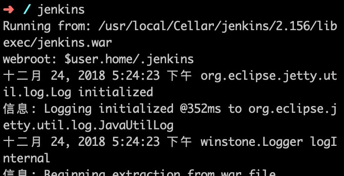

3、登录

[http://localhost:8080](http://localhost:8080/)

运行成功会在用户个人目录下新建.jenkins/文件夹
 访问localhost:8080就能到达Jenkins首页

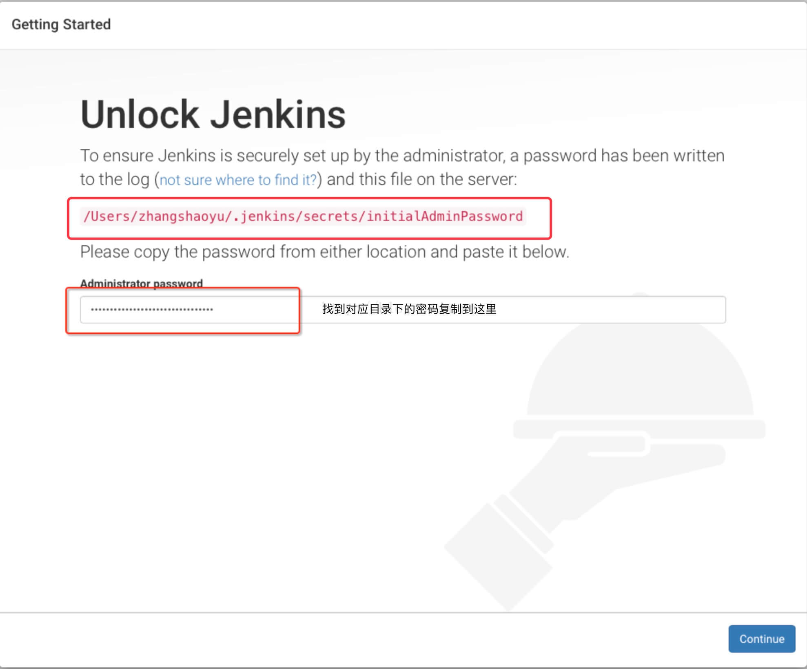
 第一次需要从文件夹下获取生成的密码登录，复制粘贴

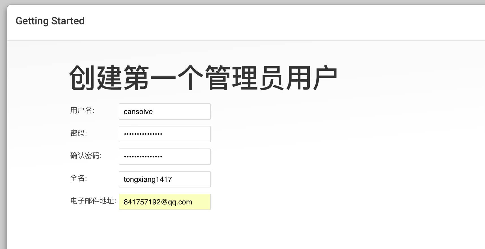

密码验证成功后进入页面，选择插件模式

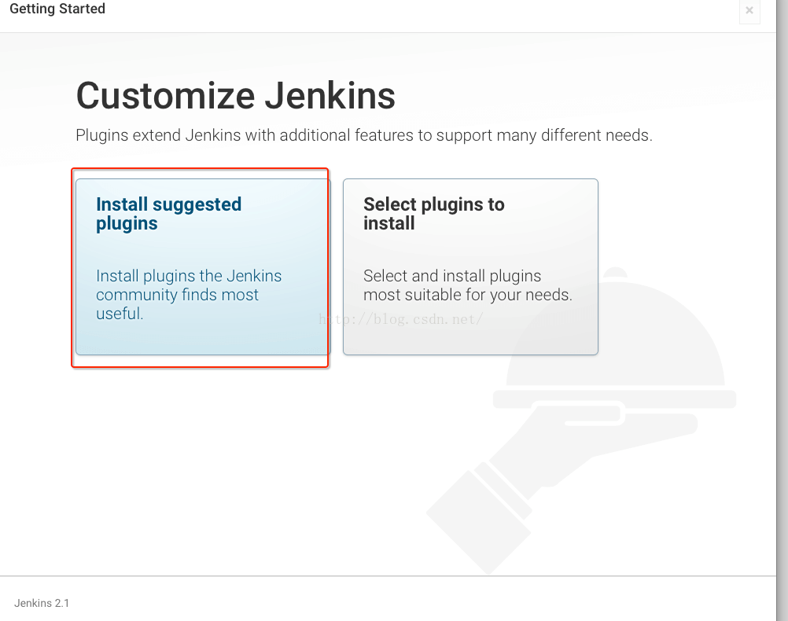
 大家都是默认选第一个

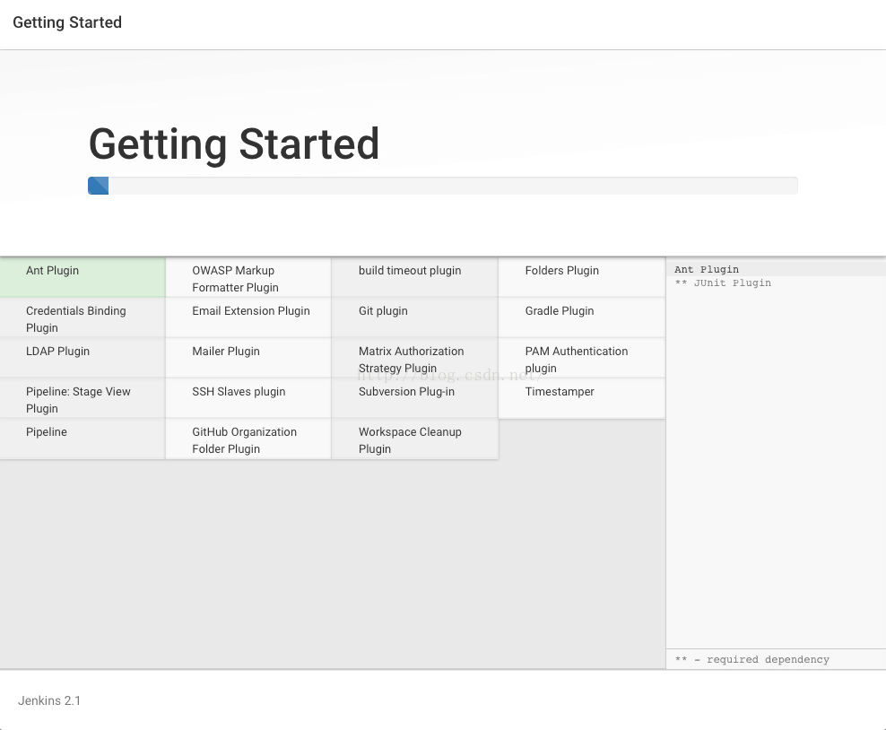
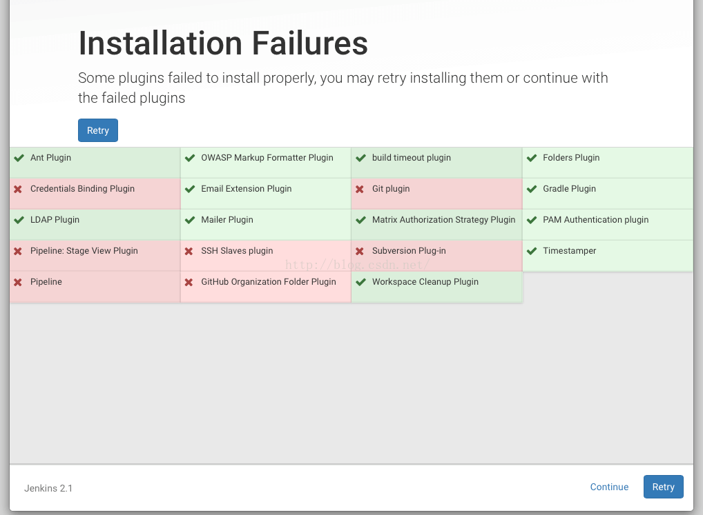
 稍等一会，插件安装好了进入用户登录界面，设定用户名、密码及邮箱。

**然后登陆就用你设置的用户名跟密码，记住哦！！**

配置项目的 jenkins job
 1、在 jenkins 左边栏点击 “新建”， 输入 job 名称，选择 “构建一个自由风格的软件项目” 一项。点击 “OK”

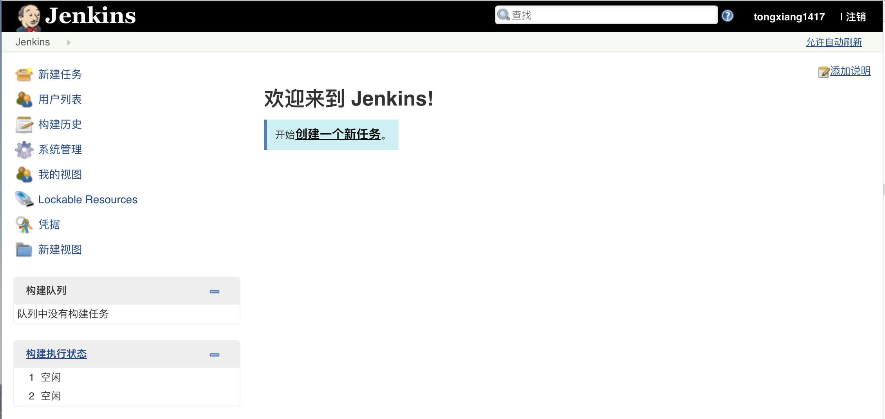

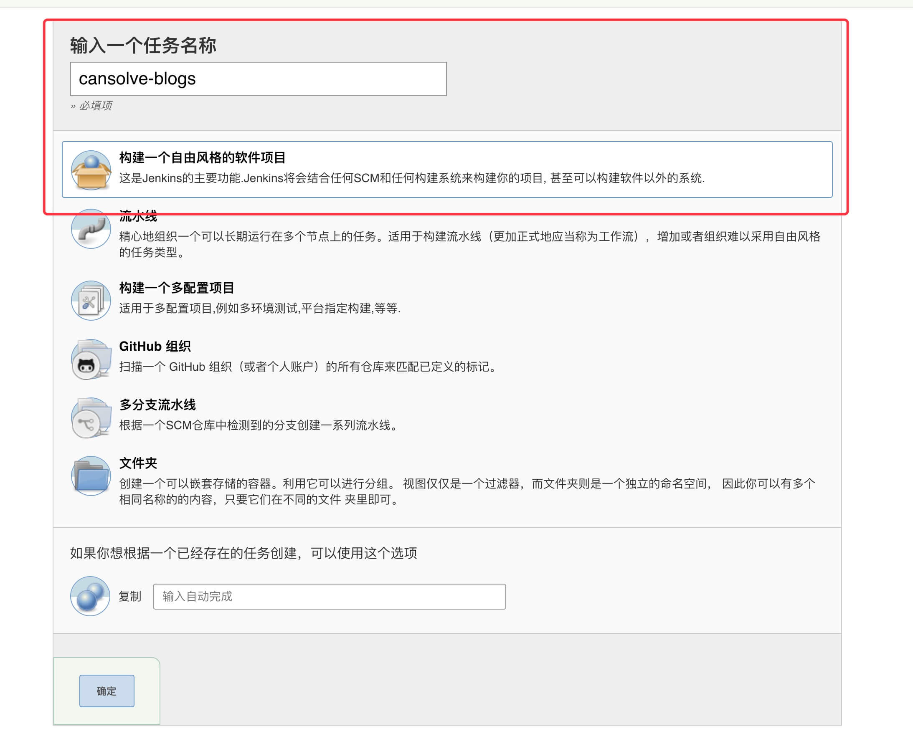
2、进入 job ”配置“页面，点击 “General” 选项，配置名称和描述，我们用的github项目，那么勾选github并且填入项目地址

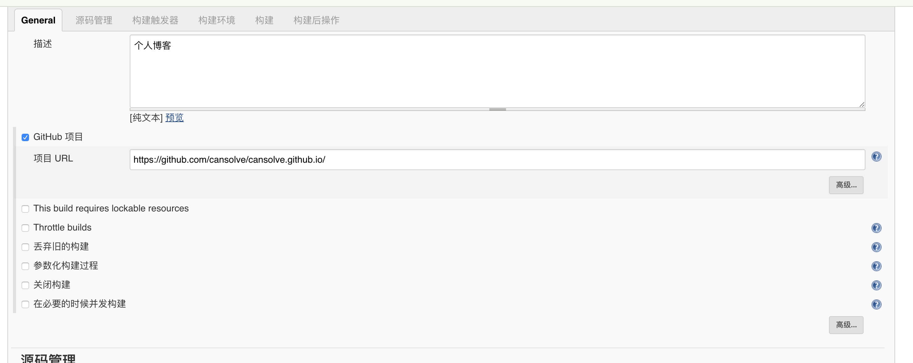
3、点击 “源码管理” 选项，配置项目的 git 仓库地址的需要构建的分支信息

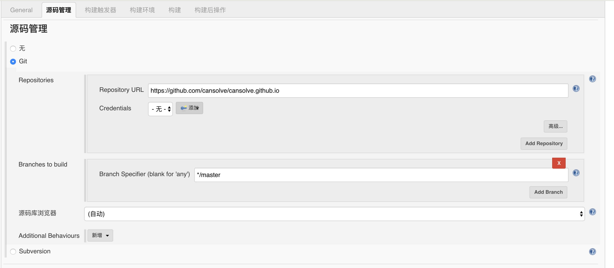
 4、点击 “构建触发器” 选项，配置 job 构建时机，勾选 “GitHub hook trigger for GITScm polling”，github hook 来触发 job 构建 ,这里没有暂时可以忽略
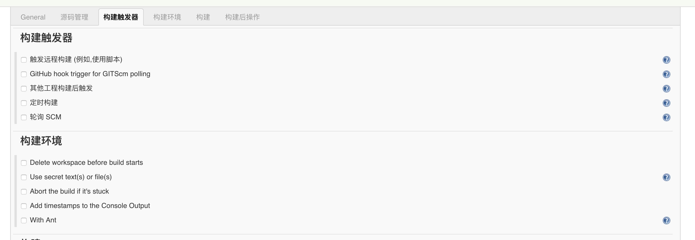

5、点击 “构建” 选项，再点击 “增加构建步骤”， 选择 “Execute shell”，配置构建命令。 如下，这里配置了 npm install、npm run unit、npm run build, 分别做安装依赖、测试、打包三件事。

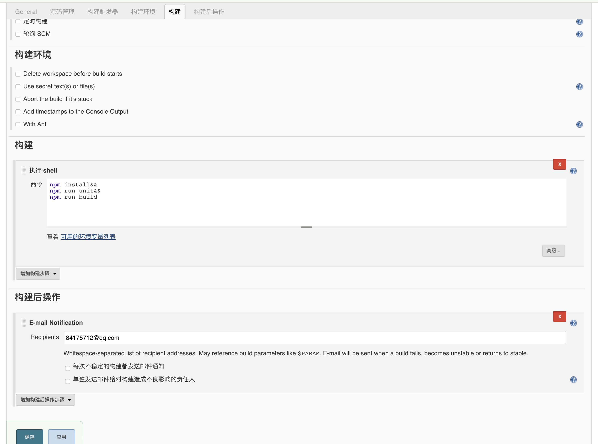

**后续继续补充**