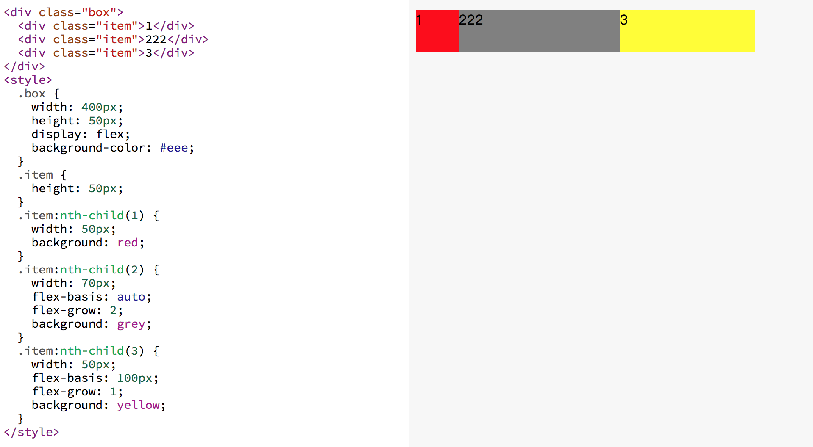
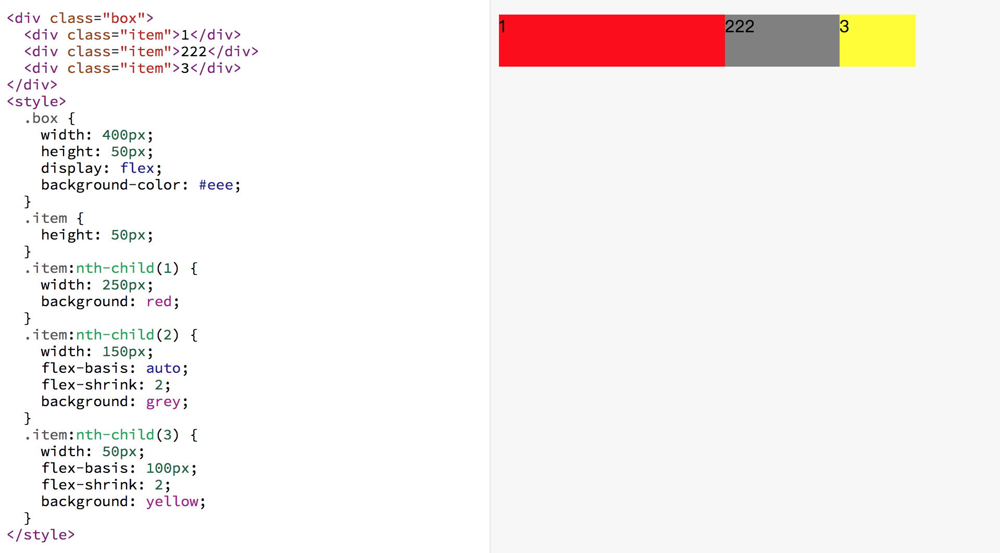
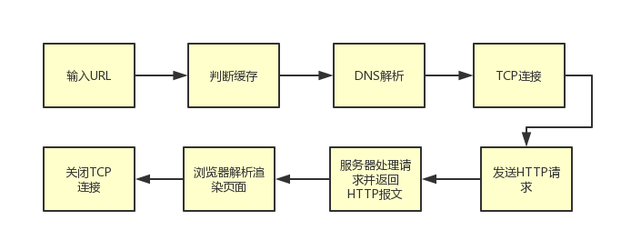

### 知道什么是事件委托吗？

[个人感觉这篇文章写的超级好，我就不班门弄斧了](https://www.cnblogs.com/liugang-vip/p/5616484.html)

### window的onload事件和domcontentloaded谁先谁后？

 一般情况下，DOMContentLoaded事件要在window.onload之前执行，当DOM树构建完成的时候就会执行DOMContentLoaded事件，而window.onload是在页面载入完成的时候，才执行，这其中包括图片等元素。大多数时候我们只是想在DOM树构建完成后，绑定事件到元素，我们并不需要图片元素，加上有时候加载外域图片的速度非常缓慢。

### 你之前遇到过跨域问题吗？是怎么解决的。

目前我知道的可以解决的方法有下面几种：

jsonp、后端java或者php修改、nginx反向代理、postMessage。。。，应该还有，只是我很少用

但是比较常用的是下面两种

1.  使用JSONP，其实用的也不多，因为感觉会导致安全问题，或者效率下降（这两点仅是我的猜测）。
    
    **猜测的理由：**
    
    -   任何来源都能访问, 会不会存在乱七八糟的js注入？
        
    -   后端和前端需要都JSONP进行处理。（代码繁琐，而且是所有请求都要使用JSONP）。
        
2.  在后端添加跨域头
    
    为`Access-Control-Allow-Origin`添加 `*`
    
    如果前端域名比较多，需要添加很多域名，为`Access-Control-Allow-Origin`添加目标域名 (`Origin 请求头`) 而不 是写死的域名或`*`
    

### typeof和instanceof的区别

typeof 是一个一元运算，放在一个运算数之前，运算数可以是任意类型。

**它返回值是一个字符串，该字符串说明运算数的类型。（**typeof 运算符返回一个用来表示表达式的数据类型的字符串。 ）

typeof其实就是判断参数是什么类型的实例，就一个参数

typeof 一般只能返回如下几个结果："number"、"string"、"boolean"、"object"、"function" 和 "undefined"。

instanceof 运算符用来测试一个对象在其原型链中是否存在一个构造函数的 prototype 属性。 语法：object instanceof constructor 参数：object（要检测的对象.）constructor（某个构造函数） 描述：instanceof 运算符用来检测 constructor.prototype 是否存在于参数 object 的原型链上。

```
function Person (name) {
    this.name = name;
}

function Student () {
    
}

Student.prototype = Person.prototype;
Student.prototype.constructor = Student;

let s = new Student('Tom');
console.log(s instanceof Person); // 返回 true
```

### 下面代码输出什么？

```
for(var i = 0; i < 10; i++) {
    setTimeout(() => {
        console.log(i)
    }, 0)
}
// 10个10
```

若要输出从0到9，怎么办？

**答案:**将var改为let，或者使用闭包。

```
// 使用闭包
for(var i = 0; i < 10; i++) {
    (function (i) {
        setTimeout(() => {
            console.log(i)
        }, 0);
    })(i);
}
```

### for of 和 for in 的区别

for in
一般用于遍历对象的可枚举属性。以及对象从构造函数原型中继承的属性。对于每个不同的属性，语句都会被执行。
不建议使用for in 遍历数组，因为输出的顺序是不固定的。
如果迭代的对象的变量值是null或者undefined, for in不执行循环体，建议在使用for in循环之前，先检查该对象的值是不是null或者undefined

for of

for…of 语句在可迭代对象（包括 Array，Map，Set，String，TypedArray，arguments 对象等等）上创建一个迭代循环，调用自定义迭代钩子，并为每个不同属性的值执行语句

上面是官方解释，我理解的最明显的区别，遍历下面数组

for in是ES5标准，遍历key.
     for of是ES6标准，遍历value.

```
var a=[1,2,3]

for(let i in a){
    console.log(i);     //0 1 2 这里的i输出的是下标
    console.log(a[i]); //1 2 3
 }
 
for(let i of a){
    console.log(i); //1 2 3  这里的i输出的是对应的值
}


```

### 使用过flex布局吗？flex-grow和flex-shrink属性有什么用？

**flex-grow**

用来“瓜分”父项的“剩余空间”。

容器的宽度为400px, 子项1的占用的基础空间(flex-basis)为50px，子项2占用的基础空间是70px，子项3占用基础空间是100px，剩余空间为 400-50-70-100 = 180px。 其中子项1的flex-grow: 0(未设置默认为0)， 子项2flex-grow: 2，子项3flex-grow: 1，剩余空间分成3份，子项2占2份(120px)，子项3占1份(60px)。所以 子项1真实的占用空间为: 50+0 = 50px， 子项2真实的占用空间为: 70+120 = 190px， 子项3真实的占用空间为: 100+60 = 160px。

**flex-shrink**

用来“吸收”超出的空间

容器的宽度为400px, 子项1的占用的基准空间(flex-basis)为250px，子项2占用的基准空间是150px，子项3占用基准空间是100px，总基准空间为 250+150+100=500px。容器放不下，多出来的空间需要被每个子项根据自己设置的flex-shrink 进行吸收。 子项1的flex-shrink: 1(未设置默认为1)， 子项2 flex-shrink: 2，子项3 flex-shrink: 2。子项1需要吸收的的空间为 `(250*1)/(250*1+150*2+100*2) * 100 = 33.33px`，子项1真实的空间为 250-33.33 = 216.67px。同理子项2吸收的空间为`(150*2)/(250*1+150*2+100*2) * 100=40px`，子项2真实空间为 `150-40 = 110px`。子项3吸收的空间为`(100*2)/(250*1+150*2+100*2) * 100 = 26.67px`，真实的空间为`100-26.67=73.33px`。

### 从输入URL到页面加载发生了什么？

这里涉及很多的东西，这里只是简单的写一下大概的答案；

1、浏览器的地址栏输入URL并按下回车。

2、浏览器查找当前URL是否存在缓存，并比较缓存是否过期。

3、DNS解析URL对应的IP。

4、根据IP建立TCP连接（三次握手）。

5、HTTP发起请求。

6、服务器处理请求，浏览器接收HTTP响应。

7、渲染页面，构建DOM树。

8、关闭TCP连接（四次挥手）。


### 你知道哪些状态码？

1xx：指示信息–表示请求已接收，继续处理。

2xx：成功–表示请求已被成功接收、理解、接受。

3xx：重定向–要完成请求必须进行更进一步的操作。

4xx：客户端错误–请求有语法错误或请求无法实现。

5xx：服务器端错误–服务器未能实现合法的请求。

平时遇到比较常见的状态码有:200, 204, 301, 302, 304, 400, 401, 403, 404, 422, 500(分别表示什么请自行查找)。

### 刚刚你说的整个过程中，有哪些优化手段可以优化提高网页响应速度？

[贴个链接，比我解释的详细](https://csspod.com/frontend-performance-best-practices/)

**补充于2018-12-28**

### 什么是圣杯布局？
官方解释：
圣杯布局是为了讨论「三栏液态布局」的实现，最早的完美实现是由 Matthew Levine 在 2006 年写的一篇文章 《In Search of the Holy Grail》 ，它主要讲述了网页中关于最佳圣杯的实现方法。

它有以下几点要求：

上部(header)和下部(footer)各自占领屏幕所有宽度。
上下部之间的部分(container)是一个三栏布局。
三栏布局两侧宽度不变，中间部分自动填充整个区域。
中间部分的高度是三栏中最高的区域的高度。

##### 实现方法1：浮动

```
<div class="header">
    <h4>header</h4>
</div>
<div class="container">
    <div class="middle">
        <h4>middle</h4>
        <p>middle-content</p>
    </div>
    
    <div class="left">
        <h4>left</h4>
        <p>left-content</p>
    </div>
    
    <div class="right">
        <h4>right</h4>
        <p>right-content</p>
    </div>
</div>

<div class="footer">
    <h4>footer</h4>
</div>
```
```
.header, .footer {
    border: 1px solid #333;
    background: #ccc;
    text-align: center;
}
.footer {
    clear: both;
}

.container {
    padding:0 220px 0 200px;
    overflow: hidden;
}
.left, .middle, .right {
    position: relative;
    float: left;
    min-height: 130px;
}
.middle {
   width: 100%;
    background: blue;
}
.left {
    margin-left: -100%;
    left: -200px;
    width: 200px;
    background: red;
}
.right {
    margin-left: -220px;
    right: -220px;
    width: 220px;
    background: green;
}
```
解析一下思路：

-   在html中，先定义好header和footer的样式，使之横向撑满。
    
-   在container中的三列设为浮动和相对定位(后面会用到)，middle要放在最前面，footer清除浮动。
    
-   三列的左右两列分别定宽200px和220px，中间部分middle设置100%撑满
    
-   这样因为浮动的关系，middle会占据整个container，左右两块区域被挤下去了
    
-   接下来设置left的`margin-left:-100%;`，让left回到上一行最左侧
    
-   但这会把middle给遮住了，所以这时给外层的container设置`padding:0 220px 0 200px;`，给left空出位置
    
-   这时left并没有在最左侧，因为之前已经设置过相对定位，所以通过`left:-200px;`把left拉回最左侧
    
-   同样的，对于right区域，设置`margin-right:-220px;`把right拉回第一行
    
-   这时右侧空出了220px的空间，所以最后设置 `right:-220px;##把right区域拉到最右侧就行了。

##### 实现方法2：flex弹性盒子 
    这个我就不贴代码了，
-    header和footer同上面一样，横向撑满。footer不用再清浮动了
-    container中的left、middle、right依次排布即可，不用特意将middle放置到最前面
-    给container设置弹性布局 display:flex;
-    left和right区域定宽，middle设置 flex:1; 即可

### 解决使用 swiper 常见的问题
**1、swiper近视初始化时, 其父级元素处于隐藏状态(display:none),会导致swiper初始化失败, 页面中的滚动效果有问题**
```

解决方法1: 
 var mySwiper = new Swiper('.demo',{
     observer: true,//修改swiper自己或子元素时，自动初始化swiper
     observeParents: true//修改swiper的父元素时，自动初始化swiper
 });
 
解决方法2: 
固定宽和高
  var mySwiper = new Swiper('.demo',{
     width:200,
     height:200
 });
 ```
**2、swiper里面的图片懒加载与预加载, 可以使用自带的 lazyload 方法**
[主要看这里-swiper4 懒加载文档](https://www.swiper.com.cn/api/lazy/213.html)

```
设为true开启图片延迟加载默认值，使preloadImages无效。或者设置延迟加载选项。
 
图片延迟加载：需要将图片img标签的src改写成data-src，并且增加类名swiper-lazy。
背景图延迟加载：载体增加属性data-background，并且增加类名swiper-lazy。
 
还可以加一个预加载，<div class="swiper-lazy-preloader"></div>
或者白色的<div class="swiper-lazy-preloader swiper-lazy-preloader-white"></div>
 
当你设置了slidesPerView:'auto' 或者 slidesPerView > 1，还需要开启watchSlidesVisibility。
 
 
var mySwiper = new Swiper('.swiper-container', {
  lazy: {
    loadPrevNext: true,
  },
});

```
**3、想在轮播图外创建分页器、上一页和下一页的按钮(因为swiper的container默认overflow:hidden, 只能在轮播图中的可视区域显示切换菜单和上一页下一页)**
```
var mySwiper = new Swiper('.swiper-container',{
    pagination : '.swiper-pagination',
    uniqueNavElements :false,
})
```

后续继续整理
