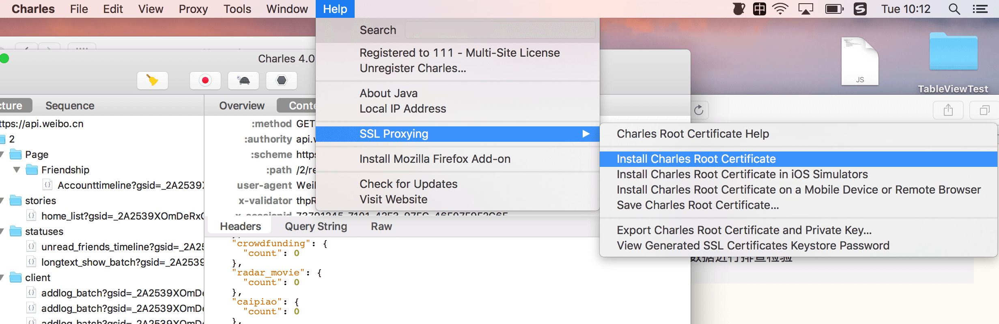
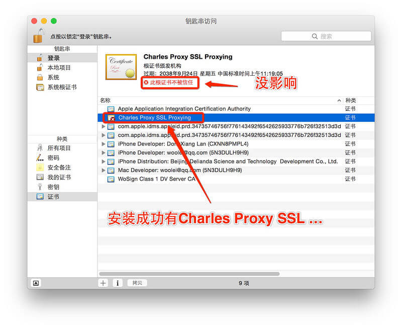
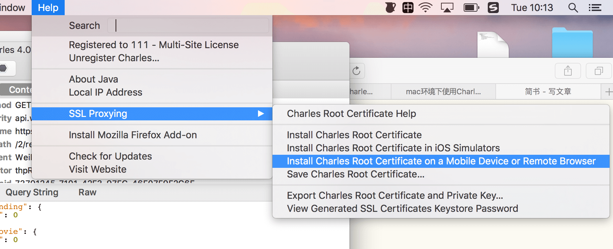
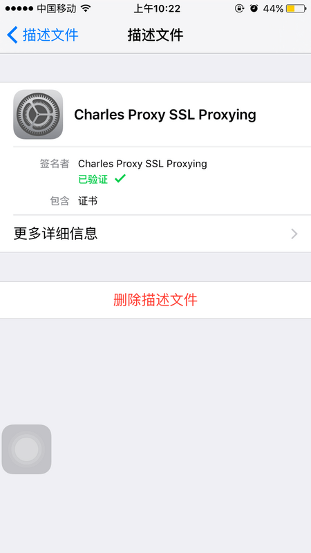
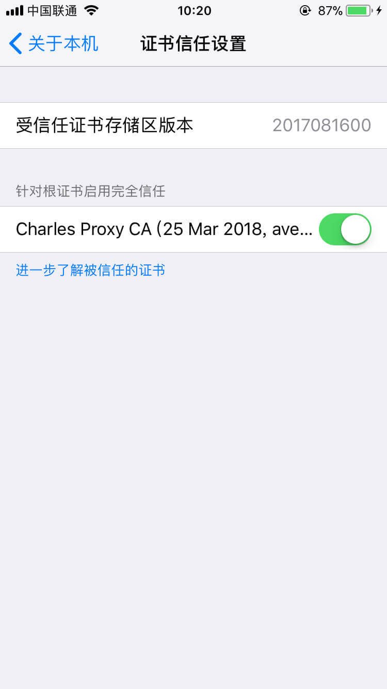
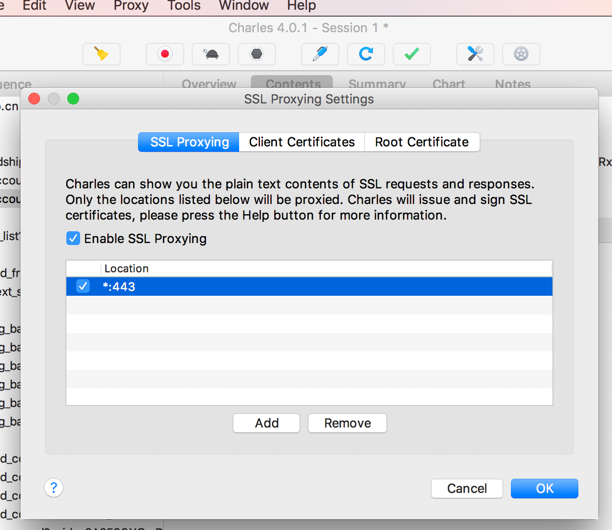
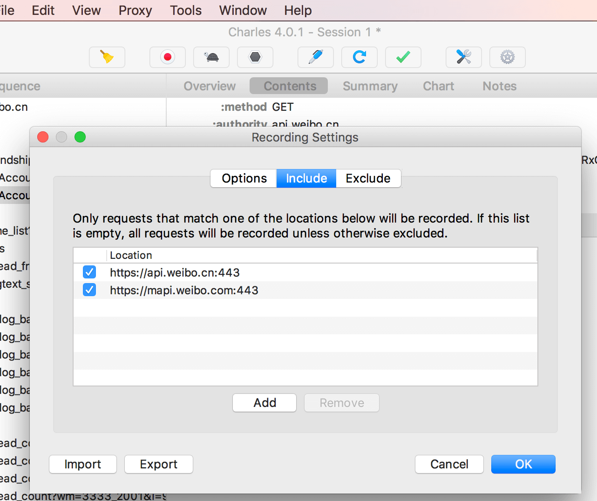
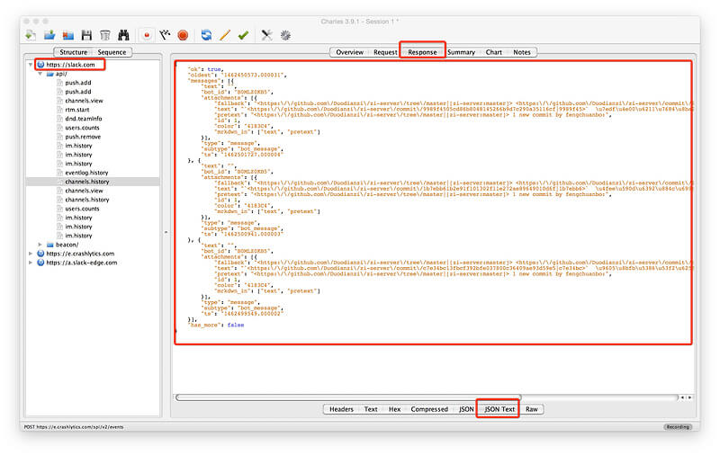

> 环境：mac OS X 
> 抓取苹果手机（ios）app里面的https请求包，对数据进行排查。Charles支持针对Https包解析。

**1.安装Charles**
**2.电脑安装Charles证书**



电脑安装证书



双击还是信任下吧

**3.手机安装证书**



手机安装证书

**4.手机网页输入网址 下载证书并信任**

```
https://www.charlesproxy.com/documentation/additional/legacy-ssl-proxying/
```
或者直接在safari 浏览器打开下面的地址就可以下载

```
https://www.charlesproxy.com/assets/legacy-ssl/charles.crt
```

手机证书下载网址



安装到手机上

`注意`：在iOS 10.3之前,当你将安装一个自定义证书,iOS会默认信任,不需要进一步的设置。而iOS 10.3之后,安装新的自定义证书默认是不受信任的。如果要信任已安装的自定义证书,需要手动打开开关以信任证书。

iOS11下需要手动信任已下载好的证书，方法如下：

> 设置->通用->关于本机->证书信任设置-> 找到charles proxy custom root certificate然后信任该证书即可.
> 
> 
> 
> iOS11下手动信任证书

**5.开始抓包**
 Charles设置Proxy
 Proxy -> SSL Proxying Settings...，如下图所示：



疑问1，如果设置成特定的域名发现还是抓不了包，不知道为什么

选择Proxy | Recording Settings，弹出Recording Settings设置选项卡，勾选include



-   抓包
    

    

[这里贴一个比较详细的过程](http://blog.devtang.com/2015/11/14/charles-introduction/)

补充：

如果用户不选择信任安装Charles的CA证书，Charles也无法获取请求内容。还有一种，如果客户端内置了本身的CA证书，这时如果Charles把自己的证书发送给客户端，客户端会发现与程序内的证书不一致，不予通过，此时Charles也是无法获取信息的。

Chrome 和 Firefox 浏览器默认并不使用系统的代理服务器设置，而 Charles 是通过将自己设置成代理服务器来完成封包截取的，所以在默认情况下无法截取 Chrome 和 Firefox 浏览器的网络通讯内容。如果你需要截取的话，在 Chrome 中设置成使用系统的代理服务器设置即可，或者直接将代理服务器设置成 127.0.0.1:8888 也可达到相同效果。