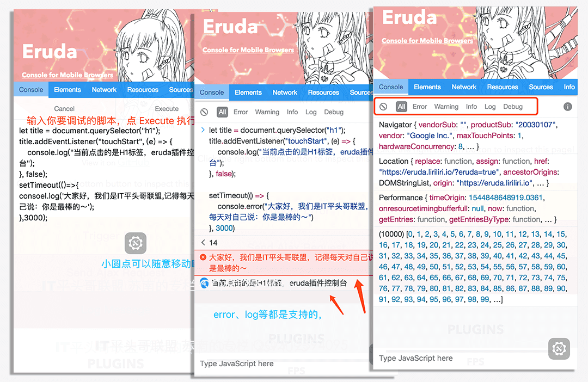
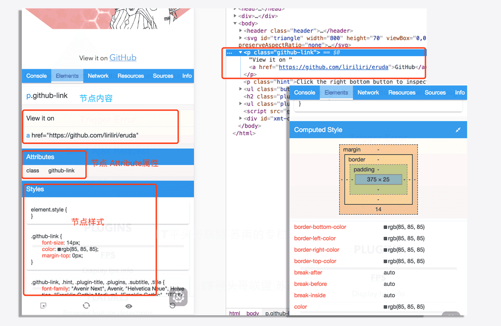
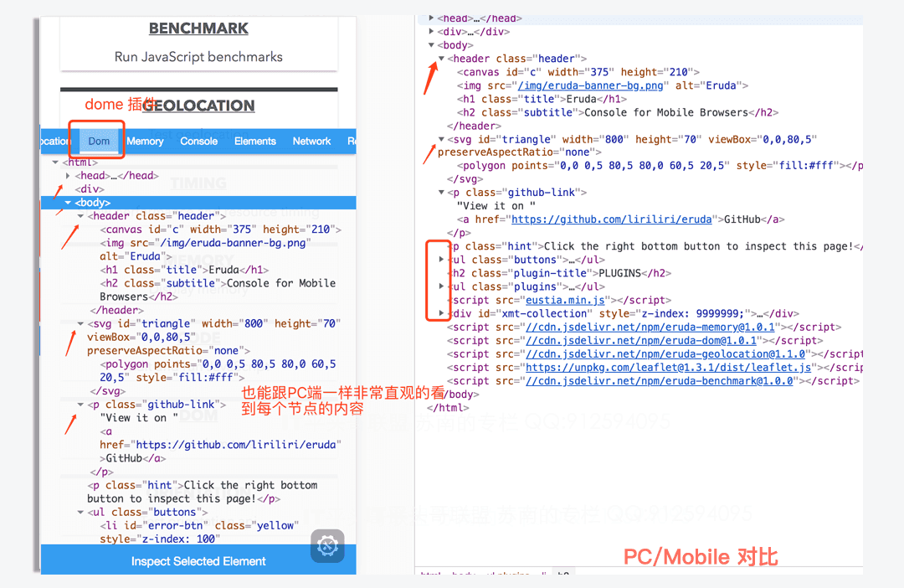
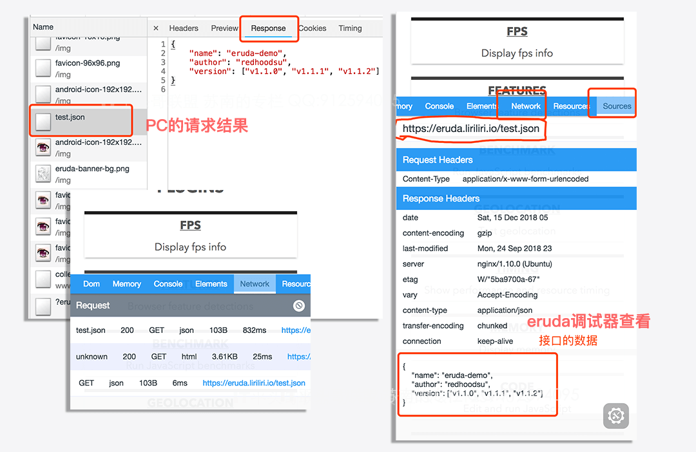
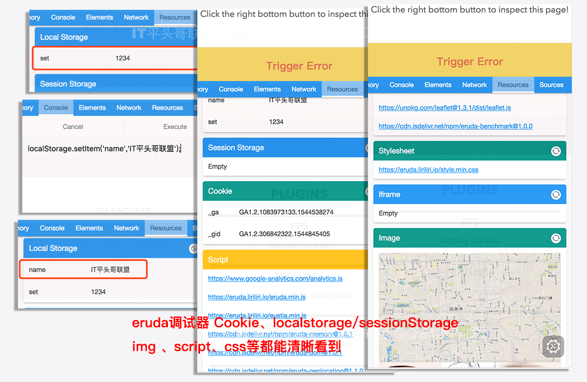
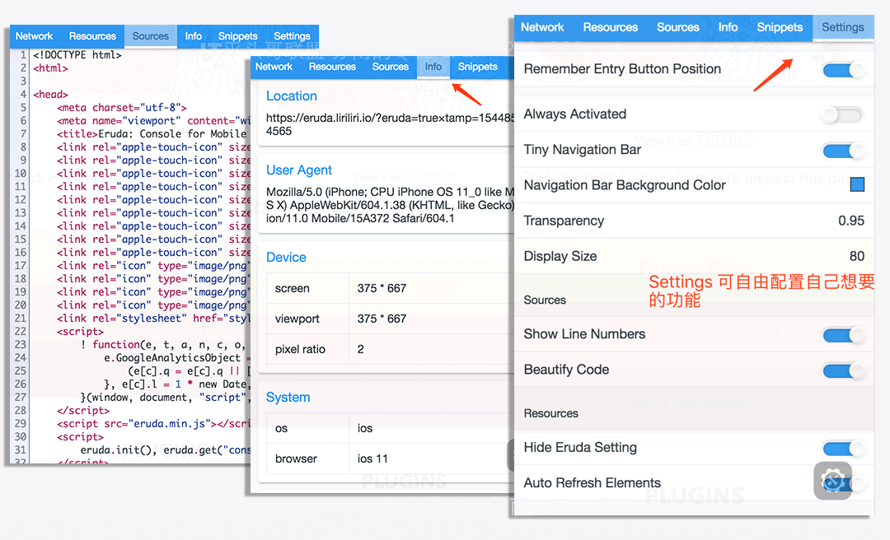

昨天介绍了一下抓包工具 [Charles](https://cansolve.cn/2018/06/26/daily13/)的使用，今天再介绍一款移动端的调试面板；
**Eruda**是什么？Eruda 是一个专为前端**移动端**、**移动端**设计的调试面板，类似`Chrome DevTools`的迷你版，其主要功能包括：捕获`console`日志、检查元素状态、显示性能指标、捕获XHR请求、显示`本地存储`和`Cookie`信息、浏览器特性检测等等。

**引用方式：**

```
方式一 默认引入：
<script src="//cdn.jsdelivr.net/npm/eruda"></script>
<script>eruda.init();</script>

方式二 动态加载：
__DEBUG__ && loadJS('http://cdn.jsdelivr.net/eruda/1.0.5/eruda.min.js', ()=>{
 eruda.init();
});

方式三 指定场景加载：
;(function () {
 var src = 'http://cdn.jsdelivr.net/eruda/1.0.5/eruda.min.js';
 if (!/eruda=true/.test(window.location) && localStorage.getItem('active-eruda') != 'true') return;
 document.write('<scr' + 'ipt src="' + src + '"></scr' + 'ipt>');
 document.write('<scr' + 'ipt>eruda.init();</scr' + 'ipt>');
})();

方式四 npm：
 npm install eruda --save
…… 加载的方式很多
```

### 功能

-   **eruda**能帮我们解决这个问题；所有的日志、错误都能帮我们捕获到，不要再去因为调试打印一堆的alert
    
-   甚至我们还能像`chrome`,直接在控制台执行js代码；
    



#### Elements

-   **eruda**它没有在PC端这么直观，但也因为在移动端展示的方式局限性，
    
-   它能把每一个父节点下的每一个子节点全部列出来；你点击某个子节点时，列出当前节点全部的属性、样式、盒子模型等；
    
-   查看标签内容及属性；查看Dom上的样式；支持页面元素高亮；支持屏幕直接点击选取；查看Dom上绑定的各类事件。
    
-   甚至也能使用`Plugins`插件，做到跟PC端一样，形成 dom tree；
    


 

#### Network

-   现在的项目大多都是前后端分享的形式了，前端处理的业务越来越多、各种请求资源等；
    
-   干的越多承担责任也越多、锅也越多，又大又平的那种哦～
    
-   所以**Network**的必要性不言而喻，它能捕获请求，查看发送数据、返回头、返回内容等信息，它对于我们平时前后端联调出现的问题定位是有很大帮助的，比如：后端说你请求参数少了，前端你看了代码逻辑没有问题，但在手机上就是调不通，Network 能很直接明了的看到你请求带了什么。
    



#### Resources

-   它跟 Chrome Devtools 里的`Application`+**Source**,两者的结合体；
    
-   Resources 它能查看 Cookie、localStorage、sessionStorage等信息，并且还能执行清除操作（Application）；
    
-   它还查看当前页面加载脚本及样式文件；查看页面加载过的图片等资源（Source）；
    
-   好吧，感觉说的再多，也不如上图直接：
    
    
    

#### Sources/Info

-   Sources：查看页面源码；格式化html，css，js代码及json数据。
    
-   Info：主要输出URL信息及User Agent；及其他的一些手机系统信息，同时也支持自定义输出内容哦。
    



## 高阶用法

-   以上刚才介绍的是它的一些基本的功能，也是我自己在工作中用的较多的；
    
-   最近发现新版本功能要强大不少，之前一直用的`1.0.5`，好像是没有插件这一项的；
    
-   大概看了一下，都蛮强大，包括上面的`Dom tree`,插件这部分并没有都实际应用过，所以也就不`打肿脸充胖子`了，有兴趣的同学可以自己看看。
    
-   如果觉得已经的插件都满足不了你的需求，它还支持自定义插件自己编写。
    


在贴一下原文地址[eruda](https://github.com/liriliri/eruda)