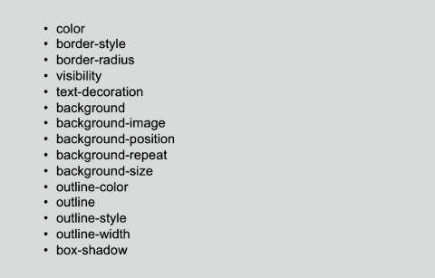

一次页面重构过程中遇到的问题，回流和重绘，面试题中经常有，可是我之前一直不是很清楚这两步具体做了什么事情。今天刚好事情做完又看到这个问题，就去查了查资料，理解一下，写了这篇文章加深一下印象，有什么写的不好的希望大家多指正。

### 浏览器的渲染过程

这里得先从浏览器的渲染过程讲起，此处你也可以跳过，因为得先了解渲染过程才能知道回流和重排在哪个阶段执行。


从这个图就可以看出浏览器渲染过程；

-   解析html和css，生成DOM树以及cssom；
    
-   html和css结合起来生成Render Tree；
    
-   **回流：** 根据生成的渲染树，进行回流(Layout)，得到可见节点的几何信息（位置，大小）
    
-   **重排：** 根据回流得到的信息结合渲染树，进行渲染展示
    
    #
    

### 生成渲染树

为了构建渲染树，浏览器主要完成了以下工作：

1.  从DOM树的根节点开始遍历每个**可见节点**。
    
2.  对于每个可见的节点，找到CSSOM树中对应的规则，并应用它们。
    
3.  根据每个可见节点以及其对应的样式，组合生成渲染树。
    

这里说到了要遍历可见的节点，什么节点是不可见的。不可见的节点包括：

1.  一些不会渲染输出的节点，比如script、meta、link等。
    
2.  一些通过css进行隐藏的节点。比如display:none。注意，利用visibility和opacity隐藏的节点，还是会显示在渲染树上的。只有display:none的节点才不会显示在渲染树上。
    

**注意：渲染树只包含可见的节点**

### 回流

前面我们通过构造渲染树，我们将可见DOM节点以及它对应的样式结合起来，**当render树中的一部分或者全部因为大小边距等问题发生改变而需要重建的过程叫做回流**。

为了弄清每个对象在网站上的确切大小和位置，浏览器从渲染树的根节点开始遍历，我们可以以下面这个实例来表示：

```
<!DOCTYPE html>
    <html>
        <head>
            <meta name="viewport" content="width=device-width,initial-scale=1">
            <title>Critial Path: Hello world!</title>
        </head>
        <body>
            <div style="width: 50%">
                <div style="width: 50%">Hello world!</div>
            </div>
        </body>
    </html>
```

我们可以看到，第一个div将节点的显示尺寸设置为视口宽度的50%，第二个div将其尺寸设置为父节点的50%。而在回流这个阶段，我们就需要根据视口具体的宽度，将其转为实际的像素值。（如下图）


### 重绘

最终，我们通过构造渲染树和回流阶段，有了DOM结构的节点，有了节点的位置样式，接下来就开始渲染到页面上，**当元素的一部分属性发生变化，如外观背景色不会引起布局变化而需要重新渲染的过程叫做重绘**

现在知道了浏览器的渲染过程，我们就来探讨下，何时会发生回流重绘。

## 何时发生回流重绘

我们前面知道了，回流这一阶段主要是计算节点的位置和几何信息，所以可以理解当页面布局和几何信息发生变化的时候，肯定会发生回流。比如以下情况：

-   添加或删除可见的DOM元素
    
-   元素的位置、尺寸发生变化（包括外边距、内边框、边框大小、高度和宽度等）
    
-   内容发生变化，比如文本变化或图片被另一个不同尺寸的图片所替代。
    
-   页面一开始渲染的时候（这肯定避免不了）
    
-   浏览器的窗口尺寸变化（因为回流是根据视口的大小来计算元素的位置和大小的）
    
-   ```
    var s = document.body.style;
     s.padding = "2px"; // 回流+重绘
     s.border = "1px solid red"; // 再一次 回流+重绘
     s.color = "blue"; // 再一次重绘
     s.backgroundColor = "#ccc"; // 再一次 重绘
     s.fontSize = "14px"; // 再一次 回流+重绘
     // 添加node，再一次 回流+重绘
     document.body.appendChild(document.createTextNode('abc!'));
    ```
    

**注意：回流一定会触发重绘，而重绘不一定会回流**

为什么：上面说了定义很明显---如外观背景色不会引起布局变化而需要重新渲染的过程叫做重绘，布局没有变化就不会发生回流；

触发回流的css 属性有这些:


而触发重绘的有这些:



说到这里大家都知道回流比重绘的代价要更高，回流的花销跟render tree有多少节点需要重新构建有关系，假设你直接操作body，比如在body最前面插入1个元素，会导致整个render tree回流，这样代价当然会比较高，但如果是指body后面插入1个元素，则不会影响前面元素的回流。

## 浏览器的优化机制

现代的浏览器都是很聪明的，由于每次重排都会造成额外的计算消耗，因此大多数浏览器都会通过队列化修改并批量执行来优化重排过程。浏览器会将修改操作放入到队列里，直到过了一段时间或者操作达到了一个阈值，才清空队列。但是！**当你获取布局信息的操作的时候，会强制队列刷新**，比如当你访问以下属性或者使用以下方法：

-   offsetTop、offsetLeft、offsetWidth、offsetHeight
    
-   scrollTop、scrollLeft、scrollWidth、scrollHeight
    
-   clientTop、clientLeft、clientWidth、clientHeight
    
-   getComputedStyle()
    
-   getBoundingClientRect
    
-   具体可以访问这个网站：[https://gist.github.com/paulirish/5d52fb081b3570c81e3a](https://gist.github.com/paulirish/5d52fb081b3570c81e3a)
    

以上属性和方法都需要返回最新的布局信息，因此浏览器不得不清空队列，触发回流重绘来返回正确的值。因此，我们在修改样式的时候，**最好避免使用上面列出的属性，他们都会刷新渲染队列。**如果要使用它们，最好将值缓存起来。

## 最小化重绘和重排

由于重绘和重排可能代价比较昂贵，因此最好就是可以减少它的发生次数。总结了以下几点：

1：用transform 代替 top，left ，margin-top， margin-left... 这些位移属性

2：用opacity 代替 visibility，但是要同时有translate3d 或 translateZ 这些可以创建的图层的属性存在才可以阻止回流

但是第二点经过我的实验，发现如果不加 transform: translateZ(0) 配合opacity的话还是会产生回流的，而只用visibility 就只会产生重绘不会回流

而 opacity 加上 transform: translateZ/3d 这个属性之后便不会发生回流和重绘了

3：不要直接使用js操作dom元素的样式，选择用一个class 代替之。

4：如果确实需要用 js 对 dom 设置多条样式那么可以将这个dom 先隐藏，然后再对其设置

5：不要在循环内获取dom 的样式例如：offsetWidth, offsetHeight, clientWidth, clientHeight... 这些。浏览器有一个回流的缓冲机制，即多个回流会保存在一个栈里面，当这个栈满了浏览器便会一次性触发所有样式的更改且刷新这个栈。但是如果你多次获取这些元素的实际样式，浏览器为了给你一个准确的答案便会不停刷新这个缓冲栈，导致页面回流增加。

所以为了避免这个问题，应该用一个变量保存在循环体外。

```
clientWidth在循环体内：
function startTest1() {
      const box1 = document.querySelector('#box1');      
      const p = document.querySelectorAll('p');
      for (let i = 0; i < p.length; i++) {
        p[i].style.width = box1.clientWidth + 'px';
      }
 }
 
clientWidth在循环体外：
function startTest2() {
      const box2 = document.querySelector('#box2');
      const p = document.querySelectorAll('p');
      const width = box2.clientWidth;
      for (let i = 0; i < p.length; i++) {
        p[i].style.width = width + 'px';
      }
 }
```

6：不要使用table 布局，因为table 的每一个行甚至每一个单元格的样式更新都会导致整个table 重新布局

7：动画的速度按照业务按需决定

8：对于频繁变化的元素应该为其加一个 transform 属性，对于视频使用video 标签

9：必要时可以开启 GPU 加速，但是不能滥用

1.  使用css3硬件加速，可以让transform、opacity、filters这些动画不会引起回流重绘
    
2.  对于动画的其它属性，比如background-color这些，还是会引起回流重绘的，不过它还是可以提升这些动画的性能。
    
    #### css3硬件加速的坑
    
    -   如果你为太多元素使用css3硬件加速，会导致内存占用较大，会有性能问题。
        
    -   在GPU渲染字体会导致抗锯齿无效。这是因为GPU和CPU的算法不同。因此如果你不在动画结束的时候关闭硬件加速，会产生字体模糊。