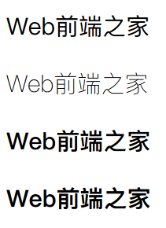
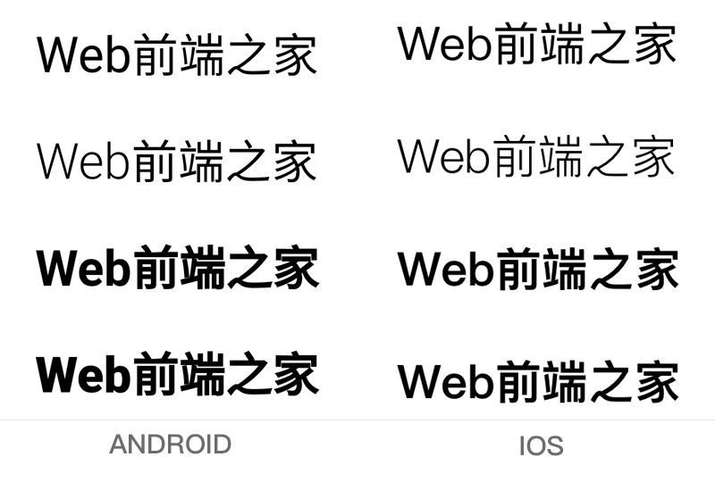

谈到“CSS中的字体”，老生常谈的话题了，在平时工作中，完成一个项目，从设计稿到页面最终的输出效果，就字体方面来说，细心的童鞋会发现有很多方面细活要去做的，当然了，这是建立在项目本身要求非常高的情况下。今天下午从两方面来讨论：设置(font-family)和粗细(font-weight)。

### 字体设置(font-family)

在写全局样式时，我们都会去设置一个默认的字体，举个例子：

1.  font-family:'PingFang SC','Microsoft YaHei','SimSun','Arial', sans-serif
    

上面的设置，会按照设置的顺序首选字体是平方字体，如没平方字体，就是显示微软雅黑，依次类推...

在设置一些中文字体的时候，不建议直接使用中文，还是回归到统一的英文，在这里分享一些常用中文转英文的字体：

华文细黑：STHeiti Light [STXihei]
 华文黑体：STHeiti
 华文楷体：STKaiti
 华文宋体：STSong
 华文仿宋：STFangsong
 儷黑 Pro：LiHei Pro Medium
 儷宋 Pro：LiSong Pro Light
 標楷體：BiauKai
 苹果丽中黑：Apple LiGothic Medium
 苹果丽細宋：Apple LiSung Light
 Windows的一些：
 新細明體：PMingLiU
 細明體：MingLiU
 標楷體：DFKai-SB
 黑体：SimHei
 宋体：SimSun
 新宋体：NSimSun
 仿宋：FangSong
 楷体：KaiTi
 仿宋_GB2312：FangSong_GB2312
 楷体_GB2312：KaiTi_GB2312
 微軟正黑體：Microsoft JhengHei
 微软雅黑体：Microsoft YaHei

装Office会生出来的一些：
 隶书：LiSu
 幼圆：YouYuan
 华文细黑：STXihei
 华文楷体：STKaiti
 华文宋体：STSong
 华文中宋：STZhongsong
 华文仿宋：STFangsong
 方正舒体：FZShuTi
 方正姚体：FZYaoti
 华文彩云：STCaiyun
 华文琥珀：STHupo
 华文隶书：STLiti
 华文行楷：STXingkai
 华文新魏：STXinwei

--可以收藏一波--

由于移动端设备过多，默认字体也会很多，首先得去了解他们的默认有哪些：

#### ios 系统

默认中文字体是Heiti SC

默认英文字体是Helvetica

默认数字字体是HelveticaNeue

无微软雅黑字体

#### android 系统

默认中文字体是Droidsansfallback

默认英文和数字字体是Droid Sans

无微软雅黑字体

#### winphone 系统

默认中文字体是Dengxian(方正等线体)

默认英文和数字字体是Segoe

无微软雅黑字体

这时候你会发现无论是ios、android还是wp系统中都是没有``微软雅黑``字体的，而且你要是做一个测试你会发现，无论页面中使用哪种字体，肉眼很难看出它们的差异，对产品的体验几乎没有影响。

#### 结论：

各个手机系统有自己的默认字体，且都不支持微软雅黑。

**如无特殊需求，手机端无需定义中文字体，使用系统默认**。

英文字体和数字字体可使用 Helvetica ，三种系统都支持。

OK，证据确凿。如果设计师需要用到一些特殊的英文字体，比如漂亮的din1451a，akzidenzgrotesk-cond等，我们需要转换下，然后用@font-face引用下即可，这个方法不多说。

### 字体粗细(font-weight)

首先我们了解下font-weight的基本属性值，如下表格：

| 值 | 描述 |
| --- | --- |
| normal | 默认值。定义标准的字符。 |
| bold | 定义粗体字符。 |
| bolder | 定义更粗的字符。 |
| lighter | 定义更细的字符。 |

-   100
    
-   200
    
-   300
    
-   400
    
-   500
    
-   600
    
-   700
    
-   800
    
-   900
    
    | 定义由粗到细的字符。400 等同于 normal，而 700 等同于 bold。 |
    
    | inherit | 规定应该从父元素继承字体的粗细。 |
    

**切记：**

**400等同于normal，而700等同于bold。**
 **inherit规定应该从父元素继承字体的粗细。**
 不过感觉效果不明显。只能换个字体试试。不过比较常见的中文字体里，感觉黑体比较粗些吧。我们看个简单的例子，WINDOWS系统PC端效果：



对应的CSS字体设置：
```
.p1{font:30px Pingfang SC}  
.p2{font:300 30px Pingfang SC}  
.p3{font:bold 30pxPingfang SC}   
.p4{font:900 30px Pingfang SC}

```
```
<!DOCTYPE html>
    <html lang="en">
        <head>
        <meta charset="UTF-8">
        <meta name="viewport" content="width=device-width, initial-scale=1.0">
        <meta http-equiv="X-UA-Compatible" content="ie=edge">
        <title>Document</title>
        <style>
            .p1{font:30px Pingfang SC}
            .p2{font:300 30px Pingfang SC}
            .p3{font:bold 30px Pingfang SC}
            .p4{font:900 30px Pingfang SC}
        </style>
    </head>
    <body>
        <p class="p1">Web前端之家</p>
        <p class="p2">Web前端之家</p>
        <p class="p3">Web前端之家</p>
        <p class="p4">Web前端之家</p>
    </body>
</html>
```

可以根据值的设置，你会发现pc上基本就是那几个明显的变化，我要说的重点是在移动端。

如果你对安卓和IOS前期的版本有了解的话，发现它们对于字体加粗属性很乱，支持性不太好，无论你怎么设置都无效，说白了就是系统BUG，^_^。

现在安卓和IOS的新版改善了好多，下面截图是安卓7.11和IOS11.2效果：



从上图发现，安卓的字体效果要比IOS要粗（请忽视字体大小），这个跟系统默认的字体有直接关系，可能也有其他的原因（请大神赐教）。这里要提醒下：有时候我们设置了加粗的样式，但是实际并没有加粗的效果，为什么呢？

很有可能就是font-weight的基础属性值设置问题，400 700这些坎，上面有提到。

### 经验总结

CSS字体设置(font-family)和粗细(font-weight)在不同设备和系统下的差别，工作中经常会碰到用一个特殊字符：五角星，箭头，圆点，箭头等等，用字体直接去设置效果，最终出来的效果出来不尽人意，这里建议就是用CSS3、图和base64等。

OK，大概就这么多，有啥不对的欢迎来喷。