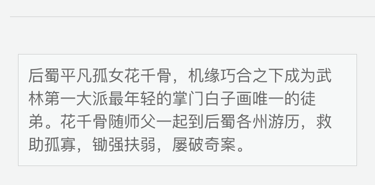
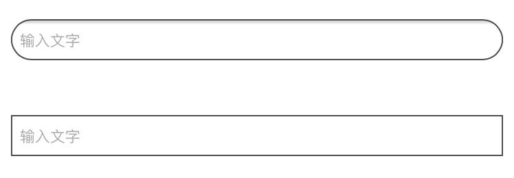
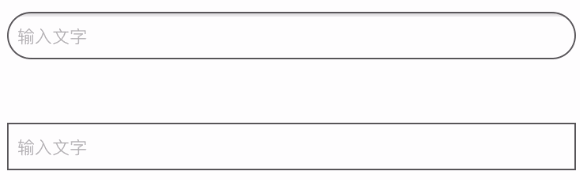
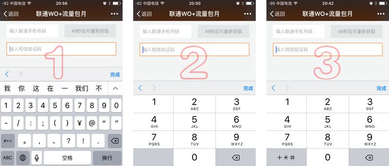
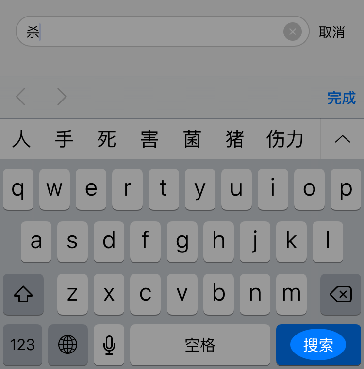

好像有好久没有写总结了，刚好最近在做移动端的h5比较多，于是就收集了一下坑，并记录了下来给大家参考一下，希望对大家有所帮助，如果没有的话或者哪里写错的，希望各位大佬提出意见，小弟立马查阅并修正。

移动端的坑真的是非常的多，毕竟机型太多了，这已经是我整理的第三篇关于移动端问题了，踩坑路漫漫，话不多说，开始

## 移动端ios下$('body')点击无效的解决方法

今天遇到一个坑，嵌入到游戏中的h5页面出现按钮点击失效问题

正常是这样的

```
$('body').click(function(e) {
   var target = $(e.target);
   if (!target.is('#more') && !target.is('.btns *')) {
       $('.btns').removeClass('open');
   $('#more').show();
   }
});
```

但是你会发现正常的pc和安卓显示中可以实现，但是在ios真机中显示有问题，因为IOS浏览器的window、document、body并不接受click事件，按钮和链接才接受click事件;

度娘了一下有人说给body加cursor：pointer;然并卵;

后面实践发现下面的写法会解决

```
$('body>*').bind('click', function(e) {
...
});
```

或者

```
$('btn').bind('click',function(e){ //点击按钮显示
    $('#more').show();
    $('body').one('click',function(){ //这里给body执行一次点击后删除事件
        $('#more').hide();
    })
    e.stopPropagation(); //这里阻止一下冒泡，因为按钮也在body里面，不让body检测到点击按钮
})
```

这样应该挺好懂吧，可以试试

## 解决：初步解决方案是给body或者html添加`overflow：hidden`样式，当然height要设置成100%

```
$("#showProup").click(function() {
      $("#mask").show(0,function(){
           $("body").css('overflow','hidden');
      });
  })
  $("#close").click(function() {
      $("#mask").hide(0,function(){
          $("body").css('overflow','scroll');
      });
  })
}
```

移动端问题比较明显，所以可以`touchmove`代替

```
$(document).on("touchmove",function(e) {
  e.preventDefault(); 
})
```

这种方法在移动端是可以解决滑动的问题，但有种情景就显得有点尴尬了，移动端屏幕本来就小，如果弹窗的内容过多也需要滑动（比如很长的活动规则），因为弹窗出现的时候已经禁止了滑动事件，此时禁止滑动之前先做一下判断---

```
$(document).on("touchmove",function(e) {
   if(e.target.className.indexOf("shadeBox") >= 0) {
        e.preventDefault();      
    } 
})
```

以上为想到的初步方案，如有更好可替换

解决：用户点击一个链接，会出现一个边框或者半透明灰色遮罩, 不同生产商定义出来额效果不一样，可设置-webkit-tap-highlight-color的alpha值为0去除部分机器自带的效果

```
a,button,input,textarea{
  -webkit-tap-highlight-color: rgba(0,0,0,0;)
  -webkit-user-modify:read-write-plaintext-only;
}
```

## 问题：移动端视频播放（安卓）总在最高层，会挡住遮罩层

解决：（初步）点开遮罩的同时隐藏video标签，关闭遮罩时在显示，达到视觉上遮挡

## 问题：移动端点击出现300ms延迟

解决：页面引用fastclick.js来避免

```
FastClick.attach(document.body);
```

## 问题：Android 上圆形图片使用 border 时，边框显示变形


解决：给 img 外嵌套一个元素，为其使用圆角

```
<div>
 
</div>
```

```
div{
  display: inline-block;
  border-radius: 50%;
  border: 4px solid #FF7000;
}
img{
  vertical-align: top;
}
```

## 问题：Android 上圆角元素，背景颜色会溢出


解决：

```
{
  background-clip: padding-box;
}
```

## 问题： Android 上圆角使用 Animation 做 loading 动画时，圆角背景色溢出的bug


解决：

```
{
  background-color: #F9CEAC;
  border-radius: 32px 0 0 32px;
  -webkit-mask-image: url(http://i.gtimg.cn/qqlive/images/20150527/btn_mask.png);
}
```

原理是使用一个圆角的蒙板通过`-webkit-mask-image`遮住多余的部分。蒙板：

## 问题：CSS 三角在 Android 上显示为方块

解决：可能是对这个三角使用了圆角，去掉`border-radius`即可

```
{
  border: 10px solid transparent;
  border-left-color: #000;
  /*border-radius: 2px;*/
}
```

## 问题： Android 上使用 svg 作为 background-image 时显示模糊

解决：设置`background-size`

```
{
  -webkit-background-size: 100%;
  background-size: 100%;
}
```

## 问题： :active 样式不生效


解决：如果给按钮定义 :hover 样式，在 iPhone 上按钮点击一次是 hover 态，再点击一次 hover 态才会消失，这显然不是我们想要的，继而想通过定义 :active 样式来实现按钮按下时的效果，但发现定义的 active 样式在 iPhone 上点击时没有任何效果。 搜索后发现，只需添加一段 js 即可：

```
document.addEventListener("touchstart", function() {},false);
```

另一个方案，可以在 body 上添加`ontouchstart=""`

原因：Safari 默认禁用了元素的`active`样式，我们通过声明`touchstart`来覆盖默认事件，就可以让`active`样式重新激活。

## 问题： 移动端多行文字超出截断需要出现省略号


解决：单行文本截断并末尾出现省略号一般写法是：

```
white-space: nowrap;
overflow: hidden;
text-overflow: ellipsis;
```

webkit 私有属性在移动端的兼容性不错， iOS 与 Android 均有不错的支持

```
display: -webkit-box;
overflow: hidden;
text-overflow: ellipsis;
-webkit-line-clamp: 2;
-webkit-box-orient: vertical;
```

其中的`-webkit-line-clamp: 2`即用来控制文本超出两行时截断并出现省略号。 在使用中如果出现第三行文字露一点头出来的问题，设置合理的`line-height`即可解决。

多行省略号用在 a 链接中时会有一个bug，省略号出现在文字中间：


这个问题的解决方案是，不要将多行省略的属性写在 a 上（或其父标签）。而在 a 内再嵌套一个标签，对其使用多行省略。

```
面对这些问题面对这些，问题面对这些问题面对这些问题面
```

```
a div{
  display: -webkit-box;
  overflow: hidden;
  text-overflow: ellipsis;
  -webkit-line-clamp: 2;
  -webkit-box-orient: vertical;
}
```

## 问题： 1px 线条、边框



解决：使用高度为 1px ，一半为实色，一半为透明的渐变背景实现

```
{
  background: -webkit-linear-gradient(top, transparent, transparent 50%, #CACDD0 50%) 0 top no-repeat;
  background-size: 100% 1px;
}
```

如果需要有四个边框都有 1px 的线框，可以使用多背景图

```
{
  background: 
  -webkit-linear-gradient(top, #CACDD0, #CACDD0 50%, transparent 50%, transparent 100%) 0 top no-repeat,
  -webkit-linear-gradient(top, transparent, transparent 50%, #CACDD0 50%, #CACDD0 100%) 0 bottom no-repeat, 
  -webkit-linear-gradient(left, #CACDD0, #CACDD0 50%, transparent 50%, transparent 100%) left 0 no-repeat, 
  -webkit-linear-gradient(left, transparent, transparent 50%, #CACDD0 50%, #CACDD0 100%) right 0 no-repeat;
  background-size: 100% 1px,100% 1px, 1px 100%, 1px 100%;
}
```

## 问题：滚动条滚动时没有像 iOS 原生那么顺滑流畅，滚动条没有 iOS 回弹效果


解决：

```
{
  overflow: auto;
  -webkit-overflow-scrolling: touch;
}
```

注：在 Android 上由于原生滚动没有回弹效果，所以这里也不会有回弹的效果。

## 问题：当模块使用系统的横向滚动时，不想显示出系统的滚动条样式


解决：

Android：

```
::-webkit-scrollbar{
  opacity: 0;
}
```

iOS 要隐藏滚动条，会稍微复杂一些

```
.wrap{
  height: 100px;
  overflow: hidden;
}
.box{
  width: 100%;
  height: -webkit-calc(100% + 5px);
  overflow-x: auto;
  overflow-y: hidden;
  -webkit-overflow-scrolling: touch;
}
```

原理：`.box`元素的横向滚动条通过其外层元素`.wrap`的`overflow:hide`来隐藏。 （5px 是 iOS 上滚动条元素的高度）

## 问题：横向滚动的元素，滑动时有时图片显示不出来/文字显示不出来


解决：给每个横滑的元素块使用硬件加速

```
li{
  -webkit-transform: translateZ(0);
}
```

## 问题：使用 animation 动画后，页面上 overflow:auto 的元素滚动条不能滑动

解决：不使用 translate 方式的动画，换为使用 left/top 来实现元素移动的动画

## 问题： 上下滑动页面时候，页面元素消失

解决：检查是否使用了 fadeIn 的 animation，如有则 fill-mode 使用 backwards 模式

```
{
  -webkit-animation: fadeIn 0.5s ease backwards;
}
```

## 问题：页面上数字自动变成了可以点击的链接


解决：在页面`<head>`里添加

```
<meta name="format-detection" content="telephone=no">
```

## 问题：input 在 iOS 中圆角、内阴影去不掉


解决：

```
input{
  -webkit-appearance: none;
  border-radius: 0;
}
```

## 问题：焦点在 input 时，placeholder 没有隐藏



解决：

```
input:focus::-webkit-input-placeholder{
  opacity: 0;
}
```

## 问题： input 输入框调出数字输入键盘

解决

```
<input type="number" />
<input type="number" pattern="[0-9]*" />
<input type="tel" />
```

分别对应下图中的1、2、3。



需要注意的是，单独使用`type="number"`时候， iOS 上出现并不是九宫格的数字键盘，如果需要九宫格的数字键盘，可选择使用 2、3 的方法。 1、2、3 在 Android 上均可以唤起九宫格的数字键盘

## 问题：搜索时，键盘的回车按钮文字设定为“搜索”



解决：`input`使用`type="search"`，放在`form`表单内。两者结合就能使输入法中的回车按钮文字变为“搜索”

```
<form action="">
 <input type="search" />
</form> 
```

## 问题：iframe 在 iOS 上没有滚动条，直接撑出去


解决：给 iframe 外嵌套一个 div， 为这个 div 设置固定高度与`overflow`

```
div{
  height: 100px;
  overflow: auto;
  -webkit-overflow-scrolling: touch;
}
```
