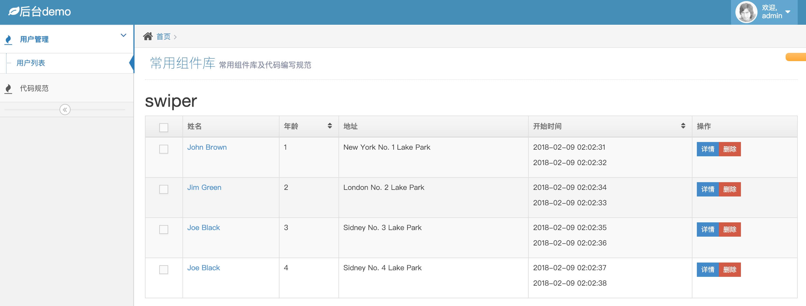
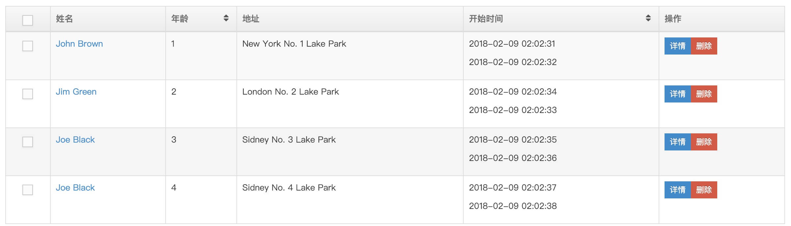
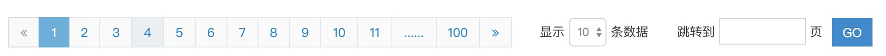
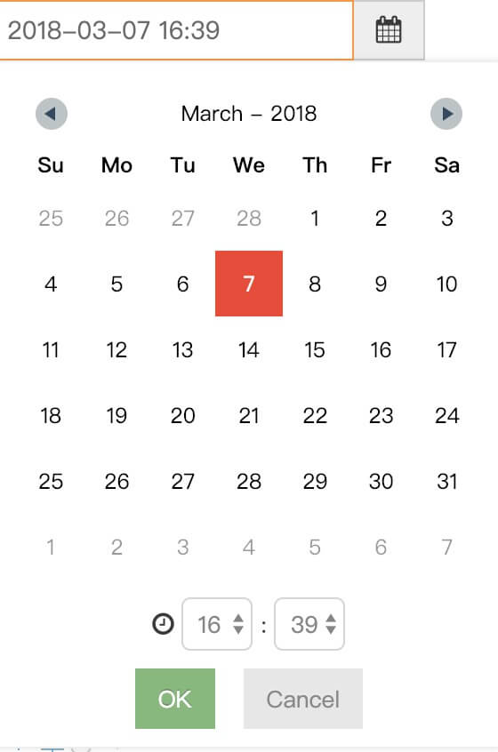
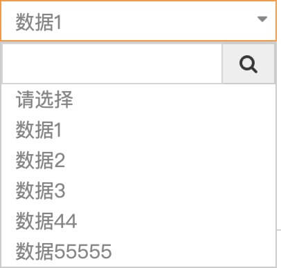
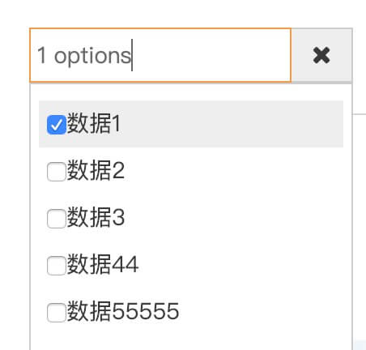
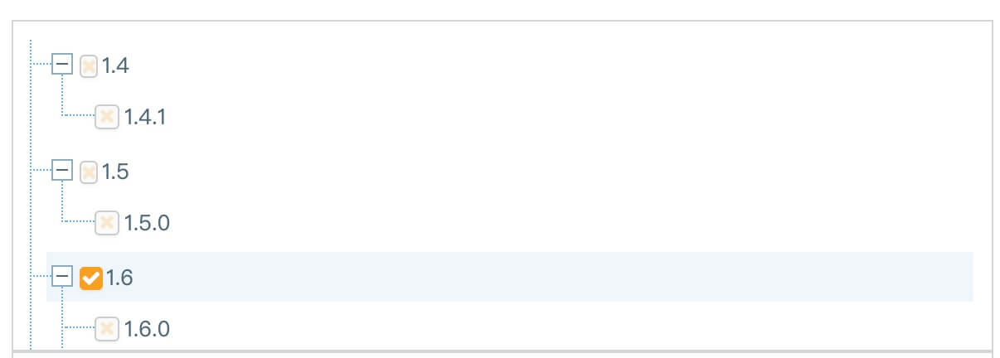
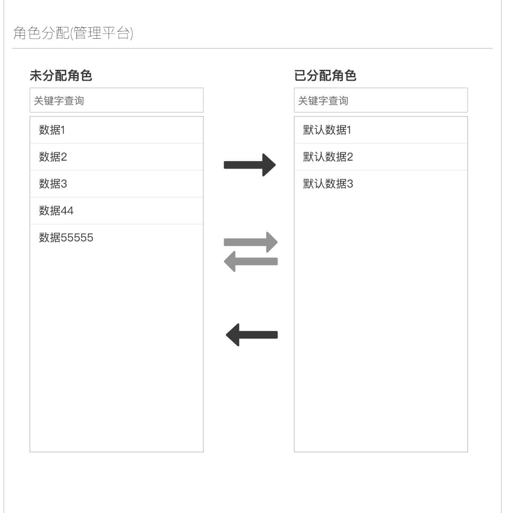
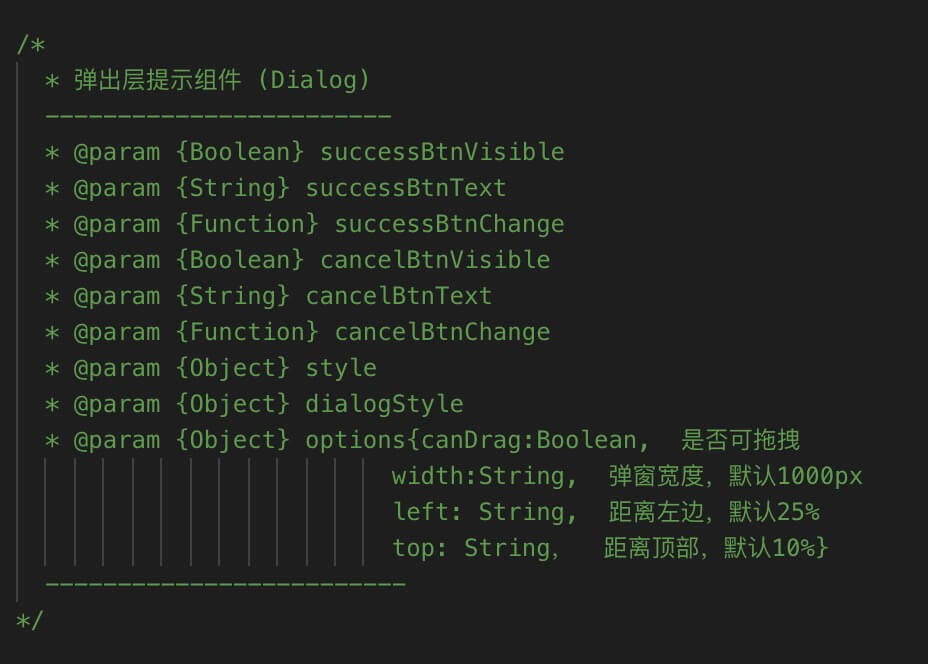

## 前言

此 react-admin 项目是基于 bootstrap-ace 框架之上，用 react 全家桶 + bootstrap  的进行再次开发的，项目已经开源，项目地址在 github 上。

框架效果预览 [http://www.pydyun.com/other/ace/index.html](http://www.pydyun.com/other/ace/index.html)
github地址 [github](https://github.com/cansolve/react-manage)

## 1. 后台管理主要项目结构

```
demo //项目名
  -- dist  //预编译，自动构建之后会生成的文件，默认初始化是没有当前这个文件
  -- asserts  //静态资源目录，css,font,image
  -- public  //html模板文件
  -- webpack  //webpack配置文件
    -- webpack.base.config.js  //公用
    -- webpack.dev.config.js  //开发环境
    -- webpack.prod.config.js  //生产环境
  -- src  //js编写文件
      -- index.js  // 初始化js
      -- module  // 基础UI模块目录
      -- tools   // js方法工具库目录
      -- action     // action 目录
      -- component  // 对应的模块 目录
      -- dispatch   // dispatch 目录
      -- reducers   // reducers 目录
      -- index.js   // 前端渲染
      -- router.js  // 前端路由
      -- store.js   // store 文件 
  -- .babelr   //babel的校验文件
  -- .eslintrc  //js编写校验配置文件
  -- .gitignore  //git过滤文件
  -- package.json  //node 安装包文件
  -- README.md   //readme 文件
```


## 2. 本地必须要有[node](https://nodejs.org/en/download/)和[git](https://git-scm.com/)环境

- webpack 4
- bootstrap + ace
- react 16
- react-router 4
- redux 3
- babel
- promise
- async +  await

----------------------------

## 3. 项目开始

  先在对应的git先创建git仓库，比如：XX管理后台 `demo` 项目，然后 `git clone`  到本来的开发环境，进入当前项目目录，代码如入：

  ```
  git clone ssh://git@github.com:cansolve/react-manage.git
  cd demo
  ```

  或者

  ```
  cd demo
  git remote add origin ssh://git@github.com:cansolve/react-manage.git
  ```

  这时，通过git来添加前端开发初始化的工程目录，代码如下：

  ```
  git remote add base ssh://git@github.com:cansolve/react-manage.git
  git pull base master --allow-unrelated-histories
  ```


  然后可以推送到开发项目上面去，代码如下：

  ```
  git add .
  git commit -m '前端项目初始化'
  git push origin demo
  ```

  到此，你的 `demo` 项目前端搭建和初始化已完毕，接下来你就可以开始 前端开发 了

  ------------------------------------


## 4. 本地项目开始
  先安装编译第三方的依赖包
  ```
  npm install
  ```

  ```
  //如果开发之前本地没有对应的server服务器，也可以用node搭个server服务器，默认是8080端口:127.0.0.1:8080,如果有的话，直接跳过这一步
  npm install -g http-server
  http-server -c-1
  ```
  ### 4.1 开发环境
  生产环境中开发监听对应的文件修改
  ```
  npm run start
  ```

  ### 4.2 生产环境

  压缩生产对应的线上文件，生产 `html`  `css`  `image`  `font`  `js`  文件
  ```
  npm run build
  ```

  -----------------------------

  ### 4.3 前端的升级和更新

  后续当前项目的前端库升级，bug修复，版本更新，直接可以通过命令来实现

  ```
  git pull base master
  ```

  如有改动跟本地开发的导致冲突，请手动处理冲突文件，然后push到对应项目中去。

## 5. 项目组建介绍

#### 5.1 表格组建

  
  说明：这里表格已经写成组建形式，只需要传入对应的title及data **后台获取数据** 即可渲染成表格，对应的可以选择排序、勾选、包括给详情加a标签功能;
#### 5.2 分页组建  
  
  说明：分页组建，点击传入对应页码，支持输入跳转;
#### 5.3 日历组建   
  
  说明：日历时间选择组建，点击展示日期列表，选择传给后台为时间戳格式;
#### 5.4 下拉选择组建 
  
  说明：点击出现下拉框，支持搜索功能
#### 5.4 下拉选择【多选】组建 
  
  说明：点击出现下拉框，多选功能
#### 5.4 树组建 
  
  说明：传入对应的数据即可渲染成树
#### 5.4 双向选择组建 
  
  说明：两边数据可以互通选择，支持一键全部选择，两边数据都支持搜索功能；

##### 具体使用api在组建里面已经写的比较详细，类似下图，再有不明白的可以联系我，一起进步；

## 5. 最后

  因为这是本人自己依据creat-react-app搭建的，跟公司项目目录还是有一定区别的，包括本人写代码的一些不好的地方还请多指正。
  大神请绕道，放小弟一条生路，谢谢啦！！
  本人公众号 **码上关注** 不定期分享一些前端知识，一起相互交流学习。